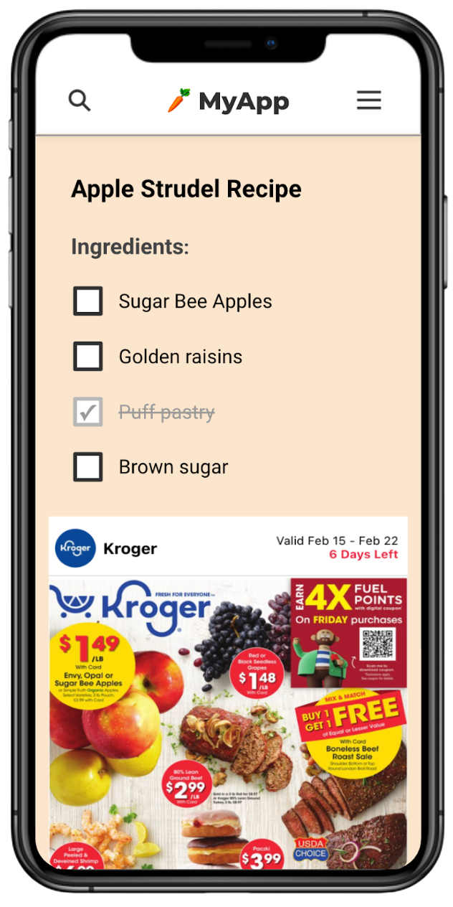

# Flipp Shopper SDK Integration Sample

This documentation describes how you can integrate with the FlippShopperSDK. 

To try it out, you can download or clone this repo to see it work within a sample app.

## Table of Contents
- [About the SDK](#about-flippshoppersdk)
- [Installation](#installation)
- [Quick Start](#quick-start)
- [Features](#features)
- [Size Modes](#size-modes)
- [Delegate Methods](#delegate-methods)

___

## About FlippShopperSDK <a name="about-flippshoppersdk"></a>
The FlippShopperSDK is a framework that provides the ability to embed the Flipp NativeX experience within an iOS app.

The SDK does this by providing a custom view called `FPWebView`, which has 2 main functionalities:

1. Renders the NativeX experience 
2. Provides delegate methods for your app to handle events from the `FPWebView`




## Installation <a name="installation"></a>
To start using FlippShopperSDK, you can follow one of the options below:
### Option #1: Use Swift Package Manager

You can use XCode's Swift Package Manager to add the FlippShopperSDK package.

- Open your project in XCode.
- Navigate to Package Dependecies > Click '+' to add a package.
- Enter this [repository's URL](https://github.com/wishabi/flipp-shopper-sdk-ios-binary) as the package URL and select the package when prompted. You may have to add your GitHub credentials to XCode for authentication.
### Option #2: Download manually
You can also include the SDK by downloading the `FlippShopperSDK.xcframework` manually from the repo's [framework folder](https://github.com/wishabi/flipp-shopper-sdk-ios-binary/tree/main/Frameworks/) and add it to your project by including it under Linked Frameworks and Libraries.

You may also need to add it under Embedded Binaries (if using the standalone binary).

___
## Quick start <a name="quick-start"></a>
### Configure the SDK
To start using the SDK, you will need to call the `FlippShopperSDK` configure method with the following required arguments. 

It is preferable to call `configure` as soon as possible, preferably near the initialization of your app.

- ``environment`` - The environment you'd like the SDK to work against
- ``siteId`` - An ID that represents the SDK client. Use values provided by Flipp
- ``zoneIds`` - (optional) An array of zones used to separate site/properties within a media partner's portfolio to facilitate content targeting. For example, a zone for sports, another for news or food. Use values provided by Flipp if applicable
- ``publisherName`` - A string that uniquely identifies the client app. Use values provided by Flipp 
- ``userId`` - A unique string anonymously identifying the current user that is used for frequency cap and improving content relevancy. For example, the userId can be a hashed ADID/IDFA, hashed email, internal app or account ID. Do not send PII in plain text or hardcode a static userID
- ``contentCode`` - (optional) A string that can be used to invoke different campaign content for testing purposes


For example:
```swift
FPShopperSDK.shared.configure(
  .dev,
  siteId: "111",
  zoneIds: ["222"],
  publisherName: "publisher-name",
  userId: "abc",
  contentCode: "publisher-test"
)
```


## Creating an instance of `FPWebView`
After configuring the SDK, you will need to create an instance of `FPWebView`.

This can be done by setting the following mandatory parameters:
- `viewController` - Current `UIViewController` that contains the webview
- `features` - (optional) An array of features you'd like to have. This is empty by default
- `shouldAutosize` - (optional) A property which allows creating a manual or autosizing webview

Here is a sample snippet of how `FPWebView` can be instantiated:

```swift
class ViewController: UIViewController, NativeXDelegate {
  private var webView: FPWebView?
  
      override func viewDidLoad() {
        super.viewDidLoad()
        // Create an instance of FPWebView and pass a UIViewController containing it
        webview = FPWebView(
          viewController: self,
          features: [.addToList, .goToUrl]
          shouldAutosize: false
        )
        // Assign a delegate
        webview.nativeXdelegate = self
      }
}
```

## Features <a name="features"></a>
The FlippShopperSDK provides additional features depending on your app's use case.

To enable/disable them, you can pass values during the `FPWebView` initialization using the parameter `features`, which expects an array of an enum. Currently, we support the following features:

1. `goToURL` - If a user taps on a link within the `FPWebView`, it is opened in the native browser. This feature must be enabled.
2. `addToList` - (optional) If a user taps on an item, this feature will notify your app through a delegate method. An example use case would be if your app has a shopping list functionality - enabling this feature would allow the SDK to send clicked items from the flyers for your app to store in the list. (For more details, see the `func didTap(item: String)` in the Delegate Methods section below)

## Size modes <a name="size-modes"></a>
The SDK supports automatic and manual sizing modes for `FPWebView`. During initialization, you can select the mode by passing the boolean variable `shouldAutosize`.

### Automatic sizing

Automatic sizing changes the webview frame based on the content's height and is enabled by default. This is the recommended sizing mode to use. 

For example, if automatic sizing is enabled and a user clicks a button causing the webview to expand, then the webview height will automatically increase to fit the content.

### Manual sizing

Set `shouldAutosize` to `false` to enable manual mode.

With manual sizing, the `FPWebView` will behave as a webview without frame change behavior. So in the same example, if by clicking a button the webview expands, you will have to change the webview height yourself by getting the actual content height from one of the following delegate methods:

`func didResize(to height: Double)`  

And/or

`func didFinishLoad(contentHeight: Double)`

Note: If you are integrating the SDK into a React Native app, you will need to expose the SDK's resizing events for both manual and auto modes from the native to JS side through RCTEventEmitter otherwise the flyer will not have any height.

## Delegate methods <a name="delegate-methods"></a>
The `FPWebView` can send events notifying your app about actions that the user has taken. 

To handle the events from `FPWebView`, you can assign a delegate to `nativeXdelegate` property. 

The following events are supported:

`func didFinishLoad(contentHeight: Double)` - Called when the webview finished loading and the content is ready to be displayed.

`func didFailToLoad(error: Error)` - Called when the webview failed to load

`func didResize(to height: Double)` - An optional method you can implement if you want to handle the webview size manually.

`func didTap(item: String)` - This method can be called if you declared support for `.addToList` feature during the webview initialization. Called when the user taps on add to list button in the view.
